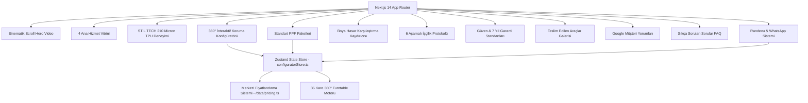

# Garaj Plus Premium — Proje Dokümantasyonu

**Garaj Plus Premium**, İstanbul Bahçelievler merkezli 13 yıllık köklü tecrübeye sahip lüks araç koruma atölyesi için geliştirilmiş; sinematik estetiği, hafif 360° interaktif araç stüdyosunu ve merkezi veri mimarisini bir araya getiren yeni nesil web uygulamasıdır.

---

## 1. Temel İşletme Bilgileri

- **İşletme Adı**: Garaj Plus Premium
- **Resmi Tanım**: Garaj Plus Premium Araç Koruma & Detailing Atölyesi
- **Hizmet Alanları**:
  1. **PPF Kaplama (Boya Koruma Filmi)** — STIL TECH 210 Micron TPU, 7 Yıl Solma & Sararma Garantisi
  2. **Araç Renk Değişimi (Folyo Kaplama)** — Mat, Saten, Parlak, Metalik Cast Folyo Uygulamaları
  3. **Araç Cam Filmi** — %99 UV Blokajı, Termal Isı İzolasyonu ve Sürüş Konforu
  4. **Boyasız Göçük Onarımı (PDR)** — Orijinal Fabrika Boyasını ve Mikron Değerini Koruyan Müdahale
- **Konum**: Bahçelievler Mah. Talatpaşa Cad. No:2, Bahçelievler / İstanbul
- **Telefon & WhatsApp**: `0546 261 13 13` / `+90 546 261 13 13`
- **Çalışma Saatleri**: Haftanın 7 Günü kesintisiz `09:00 – 20:00`
- **Müşteri Memnuniyeti**: 5.0 / 5.0 Google İşletme Profili doğrulanmış gerçek kullanıcı yorumları

---

## 2. Mimari ve Teknoloji Yığını



### Teknoloji Detayları

| Katman | Teknoloji | Görevi |
| :--- | :--- | :--- |
| **Framework** | [Next.js 14 (App Router)](https://nextjs.org/) | SSR/SSG optimizasyonu, dinamik importlar, SEO ve meta veri yönetimi |
| **Dil** | [TypeScript 5](https://www.typescriptlang.org/) | Tip güvenli veri modelleri, store ve arayüz kontratları |
| **Stil & Tasarım** | [Tailwind CSS 3.4](https://tailwindcss.com/) & Vanilla CSS | Çift tema (Karanlık Sinematik / Aydınlık Atölye Galerisi), özel tipografi ve akıcı kaydırma |
| **21st.dev Magic UI** | Custom Engineered Components | SpotlightCard (İmleç takipli radyal ışık), BorderBeam (Lazer kenar ışıması), ThemeToggle |
| **Durum Yönetimi** | [Zustand 4](https://github.com/pmndrs/zustand) | Araç platformu, seçili/korunan paneller, tema durumu (themeStore), modal ve fiyat durumu |
| **Canvas & Video** | HTML5 2D Canvas & Native Video API | 60FPS scroll-scrubbed hero video ve saydam alpha kesimli araç stüdyosu |

---

## 3. Dizin Yapısı ve Dosya Mimarisi

```
car garage/
├── public/
│   ├── vehicles/              # 360° Fotoğrafik Turntable Kareleri (36 kare/model)
│   │   ├── sedan/             # Yüksek çözünürlüklü WebP kareler (01.webp - 36.webp)
│   │   └── suv/               # Yüksek çözünürlüklü WebP kareler (01.webp - 36.webp)
│   └── videos/
│       └── hero.mp4           # 4K Sinematik stüdyo ve araç varış video kaydı
├── src/
│   ├── app/
│   │   ├── globals.css        # Genel stil tanımlamaları, reset, fontlar ve kaydırma efektleri
│   │   ├── layout.tsx         # Kök HTML, Türkçe dil tanımlaması (lang="tr") ve Türkçe SEO meta verileri
│   │   └── page.tsx           # 12 aşamalı kesintisiz müşteri yolculuğunu birleştiren ana sayfa
│   ├── components/
│   │   ├── Appointment/       # Randevu Talep Formu ve hazır şablonlu WhatsApp entegrasyonu
│   │   ├── CarConfigurator/   # 360° araç turntable, 13 panel çoklu seçimi ve boya kartelası
│   │   ├── Comparison/        # Korumasız vernik ile 210 Mikron PPF interaktif karşılaştırma kaydırıcısı
│   │   ├── CTA/               # Dönüşüm odaklı son çağrı alanı ve teklif butonları
│   │   ├── FAQ/               # Sıkça sorulan sorular akordeon bileşeni
│   │   ├── Footer/            # Bahçelievler iletişim detayları, çalışma saatleri, sosyal medya ve yasal linkler
│   │   ├── Gallery/           # Teslim edilen araçlar editoryal portföy arşivi (Togg, Mercedes, Porsche vb.)
│   │   ├── HeroScrollVideo/   # 60FPS scroll-scrubbed video canvas motoru ve sinematik Türkçe tipografi
│   │   ├── Navigation/        # Sabit cam efektli üst gezinme çubuğu ve hızlı arama/teklif butonları
│   │   ├── Packages/          # Standart koruma paketleri (Komple, Ön Koruma, Özel Paket)
│   │   ├── PPFExperience/     # STIL TECH 210 Micron TPU teknolojisi ve 4 tehdit vektörü
│   │   ├── Process/           # 6 aşamalı temiz oda işçilik protokolü
│   │   ├── QuoteModal/        # Seçilen panelleri ve araç bilgilerini listeleyen teklif çekmecesi
│   │   ├── Reviews/           # Google İşletme Profili 5.0 puanlı doğrulanmış müşteri yorumları
│   │   ├── Services/          # 4 temel hizmetin (PPF, Renk Değişimi, Cam Filmi, PDR) editoryal vitrini
│   │   └── TrustGuarantee/    # 210 Micron TPU, 7 yıl garanti ve temiz oda güven unsurları
│   ├── data/
│   │   ├── business.ts        # İşletme adı, telefon, whatsapp, adres, çalışma saatleri, garanti bilgileri
│   │   ├── faq.ts             # Türkçe sıkça sorulan sorular ve teknik yanıtlar
│   │   ├── packages.ts        # PPF paket tanımları ve merkezi fiyat bağlayıcıları
│   │   ├── panels.ts          # 13 adet Türkçe karoser paneli ve 10 adet gövde boyası renk kartelası
│   │   ├── pricing.ts         # MERKEZİ FİYATLANDIRMA SİSTEMİ (null destekli, TL para formatlayıcı)
│   │   ├── process.ts         # 6 aşamalı kusursuz temiz oda işçilik protokolü
│   │   ├── reviews.ts         # Gerçek Google İşletme müşteri yorumları ve derecelendirmeleri
│   │   ├── services.ts        # 4 Ana hizmetin detaylı açıklamaları, özellikleri ve teknik parametreleri
│   │   └── vehicles.ts        # Sedan / Spor ve SUV / Hatchback araç tipleri
│   └── lib/
│       ├── car-config/        # Araç konfigüratör tip tanımlamaları
│       ├── materials/         # Fiziksel malzeme parametreleri
│       └── store/
│           └── configuratorStore.ts # Merkezi Zustand state store
├── package.json               # Proje bağımlılıkları ve çalıştırma komutları
├── tailwind.config.ts         # Özel Tailwind renk paleti ve tema ayarları
└── tsconfig.json              # TypeScript derleyici yapılandırması
```

---

## 4. Merkezi Veri ve Fiyatlandırma Yönetimi

İşletme içeriği ve fiyatlar UI bileşenlerinden tamamen izole edilmiştir. Fiyatları güncellemek için tek bir dosyayı düzenlemeniz yeterlidir:

### Fiyat Yapılandırması: [`src/data/pricing.ts`](file:///Users/hxn/Desktop/Projects/car%20garage/src/data/pricing.ts)

```typescript
export const PRICING_CONFIG = {
  currency: 'TRY',
  currencySymbol: '₺',

  ppfPackages: {
    komple: {
      sedan: null, // Örn: 45000 yazıldığında "₺45.000" olarak gösterilir
      suv: null    // Örn: 52000 yazıldığında "₺52.000" olarak gösterilir
    },
    onKoruma: {
      sedan: null, // Örn: 22000
      suv: null    // Örn: 25000
    },
    custom: {
      sedan: null,
      suv: null
    }
  },

  ppfPanels: {
    kaput: { sedan: null, suv: null },
    on_tampon: { sedan: null, suv: null },
    camurluk_fl: { sedan: null, suv: null },
    // ...
  }
};
```

- **Fiyat `null` olduğunda**: Sitede otomatik olarak **"Teklif Alın"** veya **"Fiyat için iletişime geçin"** ibaresi yer alır.
- **Rakam girildiğinde**: `formatPrice(amount)` fonksiyonu Türkiye standartlarında binlik ayracı ile `₺45.000` çıktısı üretir.

---

## 5. Web Sitesi Müşteri Yolculuğu (12 Bölüm)

1. **00 — Üst Gezinme ([Header.tsx](file:///Users/hxn/Desktop/Projects/car%20garage/src/components/Navigation/Header.tsx))**:
   - Sabit cam efektli (backdrop blur) başlık çubuğu.
   - Hızlı arama hattı `0546 261 13 13` ve `TEKLİF AL` butonu.
2. **01 — Sinematik Scroll Hero ([HeroScrollVideo.tsx](file:///Users/hxn/Desktop/Projects/car%20garage/src/components/HeroScrollVideo/HeroScrollVideo.tsx))**:
   - Kullanıcının kaydırma hızına bağlı olarak 60FPS hızında canvas üzerinde yürütülen araç varış videosu.
   - 4 fazlı editoryal Türkçe hikaye anlatımı (*"KORUMA. KUSURSUZ İŞÇİLİK."*, *"STIL TECH 210 MICRON TPU"*).
3. **02 — Hizmetlerimiz ([ServicesSection.tsx](file:///Users/hxn/Desktop/Projects/car%20garage/src/components/Services/ServicesSection.tsx))**:
   - PPF Kaplama, Renk Değişimi, Cam Filmi ve Boyasız Göçük Onarımı (PDR) hizmetlerinin sekmeli editoryal sunumu.
4. **03 — PPF Deneyimi ([PPFExperienceSection.tsx](file:///Users/hxn/Desktop/Projects/car%20garage/src/components/PPFExperience/PPFExperienceSection.tsx))**:
   - STIL TECH 210 Micron TPU film kalınlığı, 7 yıl yazılı garanti belgesi ve boyayı tehdit eden 4 temel risk faktörü.
5. **04 — 360° Araç Stüdyosu ([CarConfigurator.tsx](file:///Users/hxn/Desktop/Projects/car%20garage/src/components/CarConfigurator/CarConfigurator.tsx))**:
   - **Porsche Stili 70/30 Bölünmüş Düzen**: Sol tarafta interaktif araç sahnesi (%70), sağ tarafta 4 adımlı PPF sihirbazı (%30).
   - **Gerçek Araç Modelleri & Çift Açı**:
     - Modern 4-Kapı Yönetici Sedan (BMW 5 / Audi A6 / VW Passat) & Lüks SUV (BMW X5 / Audi Q7).
     - `Ön 3/4 Açı` ve `Arka 3/4 Açı` arasında anında geçiş yaparak hem ön hem arka panelleri görselleştirme.
   - **Ortam Işıklandırma Seçici ([VehicleImageViewer.tsx](file:///Users/hxn/Desktop/Projects/car%20garage/src/components/CarConfigurator/VehicleImageViewer.tsx))**:
     - 🏢 **Detay Atölyesi (Garage)**: Gerçekçi tavan LED ızgaralı atölye.
     - ⚪ **Beyaz Stüdyo (White Studio)**: Maksimum kontrastlı saf beyaz temiz oda.
     - ☀️ **Gündüz Showroom (Daylight)**: Doğal gün ışığı ortamı.
     - 🌙 **Gece Sinematik (Night)**: Koyu sinematik neon hat aydınlatması.
   - **Yüksek Kontrastlı İnteraktif Panel Seçimi**:
     - Araç üzerindeki görsel odak noktalarına (hotspots) veya panel listesine tıklandığında seçilen panel parlak kehribar rengiyle (`● SEÇİLİ: Kaput`) belirginleşir.
     - PPF uygulandığında yeşil zırh durumu (`✓ PPF: Kaput`) aktifleşir.
   - **4 Adımlı PPF Odaklı İlerleme ([ConfiguratorSteps.tsx](file:///Users/hxn/Desktop/Projects/car%20garage/src/components/CarConfigurator/ConfiguratorSteps.tsx))**:
     - `01 ARAÇ`: 4-Kapı Sedan vs Lüks SUV platform seçimi.
     - `02 PPF BÖLGELERİ`: Paketler (Komple 13, Ön Koruma 6, Özel) ve akordeon gövde panelleri.
     - `03 FİLM BİTİŞİ`: Ultra Parlak Şeffaf PPF vs Saten Mat Zırh PPF.
     - `04 ÖZET & TEKLİF`: Panel dökümü, tahmini fiyat ve tek tıkla WhatsApp / Teklif Al modalı.
6. **05 — PPF Koruma Paketleri ([PackagesSection.tsx](file:///Users/hxn/Desktop/Projects/car%20garage/src/components/Packages/PackagesSection.tsx))**:
   - Komple Gövde Koruma, Ön Bölge Koruma Paketi ve Özel Panel Seçimi.
   - Tek tıkla konfigüratöre yükleme veya doğrudan teklif isteme.
7. **06 — Yüzey Karşılaştırması ([BeforeAfterComparison.tsx](file:///Users/hxn/Desktop/Projects/car%20garage/src/components/Comparison/BeforeAfterComparison.tsx))**:
   - Korumasız fabrika verniği (kılcal çizikler, taş izleri) ile 210 Mikron TPU PPF korumalı yüzey interaktif kaydırıcısı.
8. **07 — 6 Aşamalı İşçilik ([InstallationProcess.tsx](file:///Users/hxn/Desktop/Projects/car%20garage/src/components/Process/InstallationProcess.tsx))**:
   - Dijital yüzey analizi, kil & demirtozu arındırma, polisaj, temiz oda uygulaması, kenar kıvırma ve 48 nokta kalite kontrol.
9. **08 — Güven & Garanti ([TrustGuaranteeSection.tsx](file:///Users/hxn/Desktop/Projects/car%20garage/src/components/TrustGuarantee/TrustGuaranteeSection.tsx))**:
   - 210 μm TPU, 7 yıl solma-sararma garantisi ve resmi garanti sorgulama desteği.
10. **09 — Teslim Edilen Araçlar ([StudioGallery.tsx](file:///Users/hxn/Desktop/Projects/car%20garage/src/components/Gallery/StudioGallery.tsx))**:
    - Togg T10X, Mercedes C200, Porsche 911 GT3 RS, BMW M3 teslimat arşivi.
11. **10 — Google Müşteri Yorumları ([CustomerReviewsSection.tsx](file:///Users/hxn/Desktop/Projects/car%20garage/src/components/Reviews/CustomerReviewsSection.tsx))**:
    - Doğrulanmış gerçek müşteri değerlendirmeleri ve 5.0 puan göstergesi.
12. **11 — Sıkça Sorulan Sorular ([FAQSection.tsx](file:///Users/hxn/Desktop/Projects/car%20garage/src/components/FAQ/FAQSection.tsx))**:
    - PPF, sökülebilirlik, PDR ve garanti şartları hakkında detaylı yanıtlar.
13. **12 — Randevu Talep Formu ([AppointmentSection.tsx](file:///Users/hxn/Desktop/Projects/car%20garage/src/components/Appointment/AppointmentSection.tsx))**:
    - İsim, telefon, araç modeli, hizmet türü, tarih, saat ve not alanları.
    - Tek tıkla önceden biçimlendirilmiş WhatsApp randevu mesajı gönderme imkanı.
14. **13 — Teklif Çekmecesi ([QuoteModal.tsx](file:///Users/hxn/Desktop/Projects/car%20garage/src/components/QuoteModal/QuoteModal.tsx))**:
    - Kullanıcının 360° stüdyoda seçtiği panelleri, araç kasa tipini ve renk/bitiş seçimini özetleyen modal.
15. **14 — Alt Bilgi ([Footer.tsx](file:///Users/hxn/Desktop/Projects/car%20garage/src/components/Footer/Footer.tsx))**:
    - Bahçelievler adresi, telefon `0546 261 13 13`, WhatsApp, Instagram, çalışma saatleri ve hizmet linkleri.

---

## 6. Durum Yönetimi ([configuratorStore.ts](file:///Users/hxn/Desktop/Projects/car%20garage/src/lib/store/configuratorStore.ts))

Zustand durum mağazası aşağıdaki anahtar durumları ve aksiyonları yönetir:
- `vehicleType`: `'sedan' | 'suv'`
- `selectedPanelIds`: Çoklu seçimdeki aktif panel kimlikleri listesi
- `panelProtections`: Her panel için koruma durumu (`hasPPF`, `finish`, `animationProgress`)
- `globalPaint`: Seçilen otomotiv boya rengi
- `globalPPFFinish`: `'gloss' | 'satin'`
- `activePackageId`: `'komple' | 'on_koruma' | 'custom'`
- `quoteModalOpen`: Teklif çekmecesinin açık/kapalı durumu
- **Hesaplayıcılar**:
  - `getTotalProtectedPanels()`: Koruma uygulanan panel adedini döner.
  - `getSelectedPanelsNames()`: Seçilen panel isimlerini Türkçe dizi olarak döner.
  - `getProtectedPanelsNames()`: Korumadaki panel isimlerini Türkçe dizi olarak döner.
  - `getPriceEstimateDisplay()`: Tanımlı ise TL tutarını, değilse "Teklif Alın" metnini döner.

---

## 7. Performans ve UX Mühendisliği

### 1. Sıfır Reconcile Başlık Kaydırma (Header Scroll Fix)
- `Header.tsx` içerisinde `useState` yerine `headerRef` ve doğrudan `classList.add/remove` kullanılarak React render döngüsü baypas edilmiştir.
- Scroll olay maliyeti ~16ms'den ~0.1ms'ye düşürülmüş, 120Hz/60Hz ekranlarda takılmasız gezinme sağlanmıştır.

### 2. 60FPS Hero Video & Direct DOM Mutations
- `HeroScrollVideo.tsx` render döngüsünde React state yerine doğrudan `ref.current.style.opacity` ve `style.transform` manipülasyonu yapılarak tam 60Hz sinematik kaydırma elde edilmiştir.

### 3. Çift Tamponlu 360° Canvas Turntable
- `VehicleImageViewer.tsx` bileşeninde 36 karenin tamamı belleğe önceden yüklenir (preload cache) ve `HTML5 2D Canvas` üzerinde render edilir.
- `` etiket değişimi kaynaklı beyaz parlama/flaş tamamen önlenmiştir.
- Fiziksel atalet (inertia) ve sürükleme yönü hissi kazandırılmıştır.

### 4. Gerçekçi Renk Simülasyonu
- CSS `hue-rotate()` yerine `mix-blend-mode: multiply` ve `mix-blend-mode: color` katmanları kullanılarak 10 otomotiv rengi için fabrika vernik derinliği korunarak renklendirme sağlanmıştır.

### 5. Karoser Anatomisi ve Yapışkan Özet Paneli
- Panel seçimlerinde görsel hotspot noktaları, 60px dairesel metalik boya kartelası, animasyonlu `✓ PPF UYGULANDI` geribildirimi ve masaüstünde sabit kalan (`sticky`) sağ özet çubuğu konumlandırılmıştır.

---

## 8. Yerel Kurulum ve Çalıştırma

### Gereksinimler
- Node.js 18.17.0+
- npm / yarn / pnpm

### Komutlar

```bash
# Bağımlılıkları yükleyin
npm install

# Geliştirme sunucusunu başlatın (http://localhost:3000)
npm run dev

# Üretim derlemesi alın ve tip kontrolü yapın
npm run build

# Üretim sunucusunu başlatın
npm run start

# Kod kontrolü (Lint)
npm run lint
```
